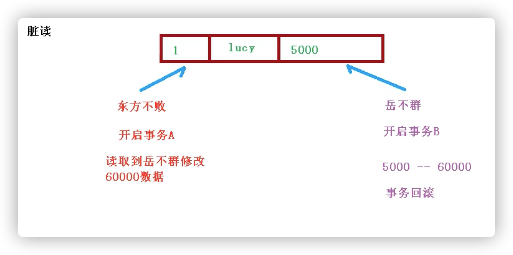
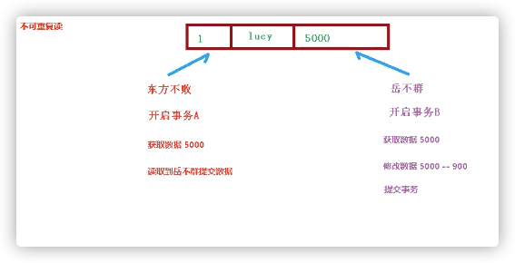

### 事务操作 -- Spring事务管理介绍
1. 事务添加到JavaEE三层结构里面Service层(业务逻辑层)

2. 在Spring进行事务管理操作
    * 有两种方式:编程式事务管理和声明式事务管理(使用)
    
3. 声明式事务管理
    1. 基于注解方式(使用)
    2. 基于xml配置文件方式
    
4. 在Spring进行声明式事务管理，底层使用AOP原理

### 事务操作 -- 注解声明式事务管理
1. 
2. 
3. 在service类上面(或者service类里面方法上面)添加事务注解
   1. @Transactional，这个注解可以添加到类上面，也可以添加到方法上面
   2. 如果把这个注解添加到类上面，这个类里面所有的方法都添加事务
   3. 如果把这个注解添加到方法上面，为这个方法添加事务

### 事务操作 -- 声明式事务管理参数配置
1. 在service类上面添加注解@Transcational，在这个注解里面可以配置事务相关参数
   * propagation:事务传播行为
      1. 多事务方法之间进行调用，这个过程中事务是如何进行管理的
         * 事务方法:对数据库表数据进行变化的操作--增删改操作
      2. Spring框架事务传播行为有7种
         * REQUIRED:如果有事务在运行，当前的方法就在这个事务内运行，否则，就启动一个新的事务，并在自己的事务内运行
         * REQUIRED_NEW:当前的方法必须启动新事务，并在它自己的事务内运行，如果有事无正在运行，应该将它挂起
         * SUPPORTS:如果有事务在运行，当前的方法就在这个事务内运行，否则它可以不运行在事务中
         * NOT_SUPPORTS:当前的方法不应该运行在事务中，如果有运行的事务，将它挂起
         * MANDATORY:当前的方法必须运行在事务内部，如果没有正在运行的事务，就抛出异常
         * NEVER:当前的方法不应该运行在事务中，如果有运行的事务，就抛出异常
         * NESTED:如果有事务在运行，当前的方法就应该在这个事务的嵌套事务内运行，否则，就启动一个新的事务，并在它自己的事务内运行
   * isolation:事务隔离级别
      * 事务有特性成为隔离性，多事务操作之间不会产生影响。不考虑隔离性会产生很多问题。
      * 有三个读问题:脏读、不可重复读和幻读
         1. 脏读:一个未提交的事务读取到另一个未提交事务的数据
            
         2. 不可重复读:一个未提交的事务读取到另一个提交的事务修改的数据
            
         3. 幻读:一个未提交的事务读取到另一个提交的事务添加的数据
      * 设置事务隔离性，解决读问题
         * READ UNCOMMITTED -- 读未提交 F F T
         * READ COMMITTED -- 读已调教 T F F 
         * REPEATABLE READ -- 可重复读 T T F
         * SERIALIZABLE -- 串行化 T T T
   * timeout:超时时间
      * 事务需要在一定时间内进行提交，如果不提交就会进行回滚
      * 默认值是-1，设置时间以秒单位进行计算
   * readOnly:是否只读
   * rollbackFor:回滚
      * 设置出现哪些异常进行事务回滚
   * noRollbackFor:不回滚
      * 设置出现哪些异常进行事务回滚

### 事务操作 -- XML声明式事务管理

### 事务操作 -- 完全注解声明式事务管理